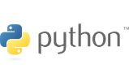

#  PYTHON FUNDAMENTALS : [Course Link](https://app.pluralsight.com/ilx/video-courses/clips/9be6a792-b1cb-4fe6-990f-9b746e31f9e6 "Python Pluralsight Course")

---

## Why Python ?   
1. **Versatile** programming language.It can be used in :   
  - Data Science
  - Machine Learning
  - Web Development

2. Strong Community   
  There is a package for everything

3. Easy to Learn   
  - easy to read
  - concise
  - interpreted language

---

## Data Types   

### Primitive data type   
Python assumes the type of variables based on data types   

```python
amount=10
```
>Python infers that amount is an **int** since its a whole number

---

```python
amount=10.5
```
>Python infers that amount is an **float** since its a decimal number


## writing python programs

## input and output


## web requests

## installing and using packages

